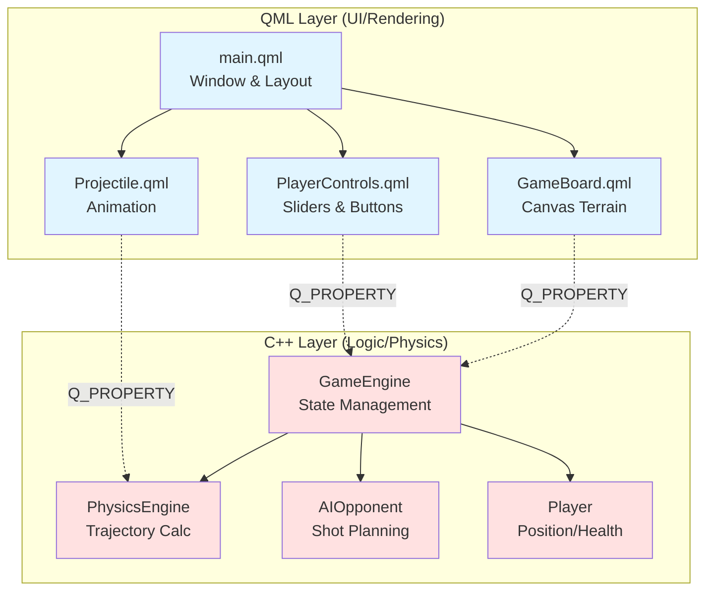
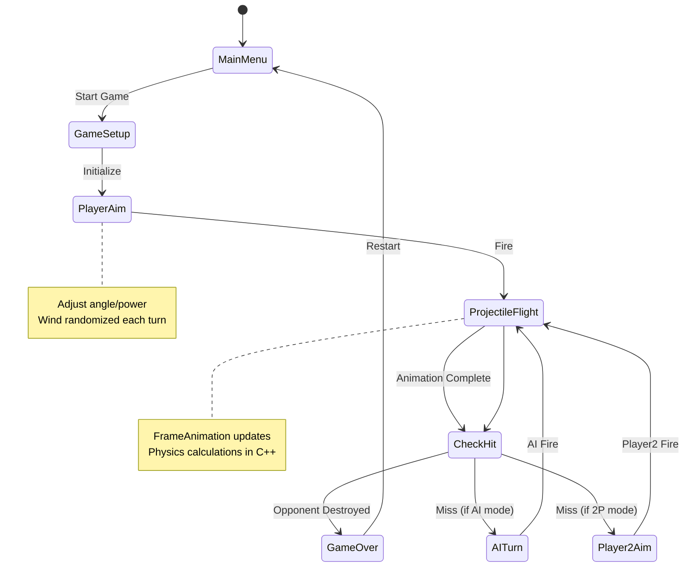

# Artillery Duel Game Implementation Plan

**Created:** 2026-08-25  
**Type:** feat  
**Status:** Ready for implementation

---

## Summary

Build a retro-faithful recreation of Artillery Duel (1983) as a Qt/QML desktop game for Linux. Turn-based artillery combat with physics-based projectile motion, supporting both 2-player hot-seat and single-player vs AI modes. C++ backend for game logic and physics, QML frontend for rendering and UI.

---

## Problem Frame

Recreate the classic C64 Artillery Duel experience as a modern Qt/QML application that runs on Omarchy and other Linux distributions. The original game featured turn-based artillery combat where players adjust angle and power to launch projectiles at each other, with realistic physics including gravity and wind effects. The recreation should preserve the retro aesthetic and core gameplay while leveraging modern Qt/QML capabilities.

---

## Requirements

**R1. Core Gameplay**
Turn-based artillery duel with angle/power controls, physics-based projectile trajectories, and terrain obstacles. Players alternate turns until one is destroyed.

**R2. Game Modes**
Support both 2-player hot-seat mode and single-player vs AI opponent.

**R3. Retro Aesthetic**
Recreate the C64 pixel art style with faithful graphics and classic game feel.

**R4. Physics Simulation**
Accurate projectile motion with gravity, initial velocity from angle/power, and wind effects.

**R5. Platform Support**
Run on Linux systems with Qt 6.11+, targeting Omarchy and other distributions.

---

## Key Technical Decisions

**KTD1: Qt/QML with C++ Backend Architecture**

Use QML for UI and rendering, C++ for physics and game logic. This follows Qt best practices and provides 7x performance improvement over pure JavaScript physics calculations.

**Rationale:** Research shows JavaScript physics in QML is significantly slower than C++ implementations. For smooth projectile animations and responsive gameplay, C++ backend is essential. QML excels at declarative UI but delegates computational work to C++.

**KTD2: CMake Build System**

Use CMake rather than qmake for project configuration.

**Rationale:** CMake is the official build system for Qt 6. qmake is deprecated for new projects.

**KTD3: Canvas-Based Terrain Rendering**

Use QML Canvas element for terrain drawing rather than pre-rendered images.

**Rationale:** Canvas provides flexibility for procedural terrain generation and destruction effects. Allows retro pixel-art style rendering while keeping assets minimal.

**KTD4: FrameAnimation for Game Loop**

Use Qt 6.4+ FrameAnimation for timing rather than Timer.

**Rationale:** FrameAnimation syncs with display refresh and provides frameTime for frame-rate independence. Ensures smooth projectile motion across different refresh rates.

**KTD5: Simple Formulaic AI**

Implement AI using trajectory calculation with random error margin, not strategic planning.

**Rationale:** Keeps AI complexity manageable for initial version. Players want challenging but beatable opponents, not perfect aim. Strategic AI can be added later if needed.

---

## High-Level Technical Design

### Component Architecture

### Game State Machine

---

## Scope Boundaries

### In Scope
- Turn-based 2-player hot-seat mode
- Single-player vs simple AI opponent
- Angle and power adjustment controls
- Physics-based projectile motion with gravity and wind
- Terrain rendering with C64-style pixel art
- Hit detection and damage system
- Basic sound effects (fire, explosion)
- Game over and restart functionality

### Deferred to Follow-Up Work
- Network multiplayer
- Advanced AI with difficulty levels or learning
- Custom terrain editor
- Achievements and statistics tracking
- Multiple terrain types or random generation
- Projectile types (different weapons)
- Destructible terrain (craters from impacts)
- Replay system
- Leaderboards

### Outside This Game's Scope
- Mobile platform support (Android/iOS)
- 3D graphics or modern rendering
- Real-time combat (not turn-based)
- Integration with Omarchy plugin system (this is a standalone application)

---

## Implementation Units

### U1. Project Setup and Build Infrastructure

**Goal:** Establish Qt/QML project structure with CMake build system and verify basic Qt 6 setup.

**Requirements:** R5 (Platform Support)

**Dependencies:** None

**Files:**
- `CMakeLists.txt`
- `src/main.cpp`
- `qml/main.qml`
- `README.md`
- `.gitignore`

**Approach:**
Create CMake project configured for Qt 6.11+ with Qt Quick and Qt Multimedia modules. Entry point in main.cpp loads QML engine and displays main.qml window. Verify Qt dependencies are available on the system.

**Test scenarios:**
- Happy path: CMake configuration succeeds with Qt 6.11+ detected
- Happy path: Application builds and displays empty window
- Edge case: Build fails gracefully with clear error if Qt 6 not found
- Edge case: Application exits cleanly when window is closed

**Verification:**
Run `cmake -B build && cmake --build build && ./build/artillery-duel` - window appears with title "Artillery Duel"

---

### U2. Core Game State Management (C++)

**Goal:** Implement C++ classes for game state, player data, and turn management, exposed to QML via Q_PROPERTY.

**Requirements:** R1 (Core Gameplay), R2 (Game Modes)

**Dependencies:** U1

**Files:**
- `src/gameengine.h`
- `src/gameengine.cpp`
- `src/player.h`
- `src/player.cpp`
- `tests/test_gameengine.cpp`

**Approach:**
GameEngine class manages game phase enum (MENU, PLAYER1_AIM, PLAYER1_FIRE, PLAYER2_AIM, PLAYER2_FIRE, AI_TURN, GAME_OVER), current player index, and win conditions. Player class stores position (x, y), health, angle, power, and score. Expose state via Q_PROPERTY so QML can bind to current phase and player data. Register types with qmlRegisterType().

**Test scenarios:**
- Happy path: Game initializes in MENU state with two players
- Happy path: State transitions correctly through turn sequence (AIM → FIRE → opponent's turn)
- Happy path: Win condition detected when player health reaches zero
- Edge case: Game mode switches between 2-player and AI modes correctly
- Integration: QML can read and update player angle/power through Q_PROPERTY bindings

**Verification:**
Unit tests verify state transitions and win detection. QML binding test confirms properties are accessible from QML layer.

---

### U3. Physics Engine (C++)

**Goal:** Implement projectile trajectory calculation, collision detection, and wind effects in C++.

**Requirements:** R1 (Core Gameplay), R4 (Physics Simulation)

**Dependencies:** U2

**Files:**
- `src/physicsengine.h`
- `src/physicsengine.cpp`
- `tests/test_physics.cpp`

**Approach:**
PhysicsEngine class calculates projectile position at time t using kinematic equations: x = x₀ + v₀ₓt, y = y₀ + v₀ᵧt - ½gt². Initial velocity components from angle and power: v₀ₓ = power × cos(angle), v₀ᵧ = power × sin(angle). Wind adds constant horizontal acceleration. Expose Q_INVOKABLE calculateTrajectory(angle, power, wind) that returns QList<QPointF> for animation path. Collision detection uses bounding box checks against terrain and opponent positions.

**Test scenarios:**
- Happy path: Projectile follows parabolic arc with no wind
- Happy path: Wind deflects trajectory horizontally as expected
- Happy path: Collision detected when projectile intersects opponent bounding box
- Edge case: Projectile with zero power travels minimal distance
- Edge case: Steep angle (near vertical) produces expected trajectory
- Edge case: Projectile off-screen (y > screen height) registers as miss
- Error path: Invalid angle or power values handled gracefully

**Verification:**
Unit tests verify trajectory calculations against known physics solutions. Collision detection tests confirm hits and misses at boundary conditions.

---

### U4. Game Board Rendering (QML)

**Goal:** Create QML Canvas-based terrain, player tank sprites, and coordinate system for the game board.

**Requirements:** R3 (Retro Aesthetic), R1 (Core Gameplay)

**Dependencies:** U2

**Files:**
- `qml/GameBoard.qml`
- `qml/Tank.qml`
- `assets/tank_left.png`
- `assets/tank_right.png`
- `assets/terrain_pattern.png`

**Approach:**
GameBoard.qml uses Canvas element to draw retro pixel-art terrain with C64 color palette (brown/green gradient). Terrain is flat with random elevation variations. Tank.qml is Image component showing 16x16 pixel tank sprite, positioned at player coordinates from GameEngine. Use QML anchoring and Item positioning for coordinate space (origin top-left, y increases downward). Canvas onPaint handler draws terrain once at startup.

**Test scenarios:**
- Happy path: Terrain renders with retro pixel aesthetic
- Happy path: Both player tanks visible at starting positions
- Happy path: Tanks positioned correctly on terrain surface
- Edge case: Window resize maintains aspect ratio and scales terrain
- Integration: Tank positions update when GameEngine player coordinates change

**Verification:**
Visual inspection confirms retro aesthetic. Position binding test verifies tanks move when C++ Player coordinates update.

---

### U5. Player Controls (QML)

**Goal:** Implement angle and power adjustment UI using Qt Quick Controls, bound to C++ GameEngine.

**Requirements:** R1 (Core Gameplay)

**Dependencies:** U2, U4

**Files:**
- `qml/PlayerControls.qml`
- `tests/test_controls_binding.cpp`

**Approach:**
PlayerControls.qml contains two Sliders (angle 0-90°, power 0-100) and a "Fire" Button. Sliders bind to GameEngine.currentPlayer.angle and .power via two-way Q_PROPERTY bindings. Fire button calls GameEngine.fireProjectile() Q_INVOKABLE method. Add keyboard support: arrow keys adjust angle, space fires. Controls disabled during FIRE and AI_TURN phases. Display current values as retro-styled labels above sliders.

**Test scenarios:**
- Happy path: Angle slider updates player angle in GameEngine
- Happy path: Power slider updates player power in GameEngine
- Happy path: Fire button triggers fireProjectile() method
- Happy path: Keyboard arrow keys adjust angle, space fires
- Edge case: Controls disabled when not player's turn (FIRE/AI_TURN phases)
- Edge case: Slider values clamped to valid ranges (angle 0-90, power 0-100)
- Integration: Changes in QML sliders immediately reflect in C++ Player object

**Verification:**
Interaction test confirms slider changes update C++ properties. Button click test verifies fireProjectile() is called. Keyboard event test validates arrow/space key handling.

---

### U6. Projectile Animation and Effects

**Goal:** Animate projectile flight using FrameAnimation and physics trajectory, with explosion effects on impact.

**Requirements:** R1 (Core Gameplay), R4 (Physics Simulation)

**Dependencies:** U3, U4

**Files:**
- `qml/Projectile.qml`
- `qml/Explosion.qml`
- `assets/projectile.png`
- `assets/explosion_frames.png`

**Approach:**
Projectile.qml is an Image item (8x8 pixel retro sprite) positioned via x/y properties. FrameAnimation updates position each frame by querying PhysicsEngine.trajectoryPointAtTime(elapsedTime). On each frame, check collision via PhysicsEngine.checkCollision(x, y). If collision detected, stop animation, hide projectile, show Explosion.qml (AnimatedSprite with 4-frame pixel explosion). After explosion completes, GameEngine advances to next turn.

**Test scenarios:**
- Happy path: Projectile animates smoothly along calculated trajectory
- Happy path: Explosion animation plays on impact with opponent
- Happy path: Explosion animation plays when projectile hits terrain
- Happy path: Game state advances to next turn after explosion completes
- Edge case: Projectile animation stops if it travels off-screen (miss)
- Edge case: Frame rate independence - same trajectory at 60fps and 120fps
- Integration: Collision detection from PhysicsEngine correctly triggers explosion

**Verification:**
Visual inspection confirms smooth animation. Frame timing test verifies trajectory independence from refresh rate. Collision test confirms explosion triggers on hit.

---

### U7. AI Opponent Implementation

**Goal:** Implement simple AI that calculates trajectory to hit player with random error margin.

**Requirements:** R2 (Game Modes)

**Dependencies:** U2, U3

**Files:**
- `src/aiopponent.h`
- `src/aiopponent.cpp`
- `tests/test_ai.cpp`

**Approach:**
AIOpponent class has Q_INVOKABLE calculateShot(targetX, targetY, wind) method. Uses inverse kinematics to solve for angle/power that hits target: given target position and wind, iterate through angle range to find power that lands near target. Add random error (±5° angle, ±10% power) so AI is beatable. Expose to QML via qmlRegisterType(). GameEngine calls AI.calculateShot() during AI_TURN phase, applies result to AI player, then transitions to FIRE phase.

**Test scenarios:**
- Happy path: AI calculates valid shot that lands near player position
- Happy path: AI accounts for wind when calculating trajectory
- Happy path: Random error prevents perfect accuracy - shots scatter around target
- Edge case: AI handles case where no valid solution exists (target out of range)
- Edge case: AI adjusts for different starting positions (left vs right side)
- Integration: AI-calculated angle/power values fall within valid ranges (0-90°, 0-100)

**Verification:**
Unit tests verify shot lands within acceptable radius of target. Statistical test over 100 shots confirms error distribution. Integration test verifies AI decisions work with GameEngine state machine.

---

### U8. Game Flow and UI Integration

**Goal:** Implement main menu, game over screen, and complete turn-based flow connecting all components.

**Requirements:** R1 (Core Gameplay), R2 (Game Modes)

**Dependencies:** U2, U4, U5, U6, U7

**Files:**
- `qml/main.qml` (updated)
- `qml/MainMenu.qml`
- `qml/GameOverScreen.qml`
- `qml/HUD.qml`

**Approach:**
main.qml uses StackView to switch between MainMenu, GameBoard, and GameOverScreen based on GameEngine.gamePhase. MainMenu has "2-Player" and "vs AI" buttons that call GameEngine.startGame(mode). HUD.qml shows current player, angle, power, wind speed, and health bars. GameOverScreen displays winner and "Play Again" button. Game loop: Player adjusts controls → fires → projectile animates (U6) → collision check → damage applied → turn switches → repeat until win condition → GameOverScreen.

**Test scenarios:**
- Happy path: Main menu starts, mode selection launches game
- Happy path: Complete 2-player game flow from start to game over
- Happy path: Complete AI game flow with AI taking turns correctly
- Happy path: HUD updates during gameplay (turn indicator, health bars)
- Happy path: Game over screen displays correct winner
- Happy path: "Play Again" restarts game in same mode
- Edge case: Switching between 2-player and AI modes works correctly
- Integration: All state transitions (MENU → SETUP → AIM → FIRE → next turn → GAME_OVER) execute correctly

**Verification:**
End-to-end test plays complete game in both modes. State transition test verifies all phases are reached. UI test confirms screens render correctly at each phase.

---

### U9. Audio and Polish

**Goal:** Add sound effects for firing and explosions, refine retro aesthetic, and polish UI.

**Requirements:** R3 (Retro Aesthetic)

**Dependencies:** U8

**Files:**
- `qml/main.qml` (updated)
- `assets/sounds/fire.wav`
- `assets/sounds/explosion.wav`
- `assets/fonts/c64_font.ttf`

**Approach:**
Add SoundEffect components in main.qml for fire and explosion sounds. Trigger fire sound when fireProjectile() called, explosion sound when collision detected. Use 8-bit style WAV files (can generate with tools like sfxr). Apply C64 font to all text elements via FontLoader. Add retro color palette (#6c5eb5 background, #5c47e4 UI chrome). Polish slider styling to match retro aesthetic. Ensure all UI elements use pixel-perfect positioning.

Test expectation: none - this is polish work with no new behavioral logic.

**Verification:**
Visual inspection confirms retro aesthetic consistency. Audio playback test confirms sounds trigger at correct moments without latency.

---

## Risks and Dependencies

**Risk: Qt 6 Availability on Target Systems**

Some Linux distributions may not package Qt 6.11+ yet. Users on older distros may need to build Qt from source.

*Mitigation:* Document minimum Qt version clearly in README. Provide fallback instructions for building with Qt 6.4+ (minimum for FrameAnimation). Target Omarchy specifically, which ships modern Qt.

**Risk: Performance of QML Canvas on Lower-End Hardware**

Canvas rendering may be slow on older GPUs or systems without hardware acceleration.

*Mitigation:* Keep terrain complexity low (simple shapes, minimal gradients). Profile on target hardware early. If needed, fall back to pre-rendered terrain images instead of Canvas.

**Risk: Audio Requires FFmpeg Runtime**

Qt Multimedia on Linux requires FFmpeg or GStreamer installed. Missing dependencies cause silent audio failure.

*Mitigation:* Document audio dependencies in README. Provide graceful degradation - game plays without sound if Qt Multimedia fails to load. Test on clean system to verify dependency messages.

**Dependency: glibc 2.34+**

Qt 6 requires glibc 2.34 or newer, which may not be available on older distributions (pre-2022).

*Mitigation:* Target modern distributions (Arch, Fedora 36+, Ubuntu 22.04+). Omarchy is Arch-based and ships current glibc.

---

## Open Questions

**Q1: Should destructible terrain be in the initial version or deferred?**

*Status:* Deferred - added to "Deferred to Follow-Up Work". Destructible terrain (craters from impacts) adds significant complexity to collision detection and terrain rendering. Implement core gameplay first, add terrain destruction as enhancement.

**Q2: What level of wind variability makes for good gameplay?**

*Status:* Defer to implementation - test different wind ranges during development. Start with ±20% horizontal velocity modifier, tune based on playtesting. Too much wind makes game frustrating; too little makes it trivial.

---

## Sources and Research

**Qt/QML Game Development:**
- [QML Best Practices](https://doc.qt.io/qt-6/qtquick-bestpractices.html)
- [FrameAnimation in Qt 6.4](https://www.qt.io/blog/new-in-qt-6.4-frameanimation-element)
- [QML Advanced Tutorial - SameGame](https://doc.qt.io/qt-6/qml-advtutorial.html)
- [Cross-Platform Game Development with Qt](https://medium.com/@paulovap/cross-platform-game-development-with-qt-and-bacon2d-part-1-d041b551c5ef)

**Qt 6 Documentation:**
- [Canvas QML Type](https://doc.qt.io/qt-6/qml-qtquick-canvas.html)
- [Qt Quick Controls](https://doc.qt.io/qt-6/qtquickcontrols-index.html)
- [PropertyAnimation](https://doc.qt.io/qt-6/qml-qtquick-propertyanimation.html)
- [SoundEffect](https://doc.qt.io/qt-6/qml-qtmultimedia-soundeffect.html)
- [Qt 6 Build System (CMake)](https://doc.qt.io/qt-6/qt6-buildsystem.html)

**Omarchy Platform:**
- [Omarchy 4.0 Release](https://www.phoronix.com/news/Omarchy-4.0-Released)
- [Omarchy GitHub Repository](https://github.com/basecamp/omarchy)
- [Omarchy Plugin Marketplace](https://omarchyplugins.com/)

**Artillery Game Mechanics:**
- [Artillery Game - Wikipedia](https://en.wikipedia.org/wiki/Artillery_game)
